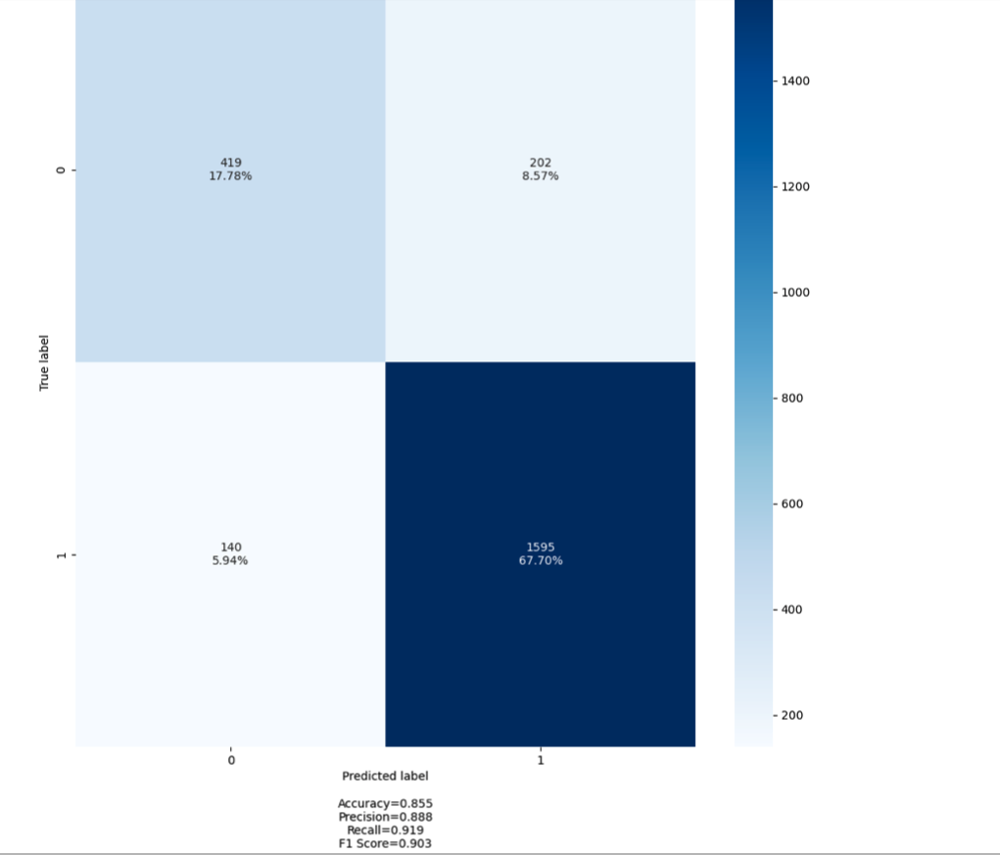
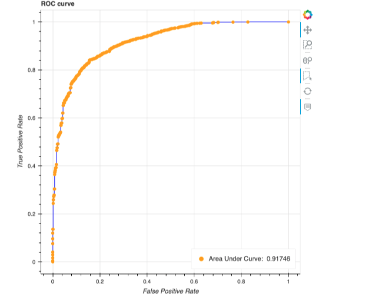

# AI_Learning_SageMaker_Evaluate_Model

This repository focuses on analyzing and understanding the XGBoost training report generated after training a machine learning model using Amazon SageMaker. The notebooks in this repo explore key training metrics, model performance indicators, and validation results produced by XGBoost. The goal is to build a clear understanding of how the model behaved during training, what the metrics mean, and how to interpret them in a practical, real-world context. This work is part of my broader learning journey into AWS AI and machine learning, with a strong emphasis on model evaluation, observability, and production readiness, rather than just training a model and moving on.

## Tasks

### Task 1: Confusion Matrix

In this repository, I'm working with supervised learning on tabular data to predict the income column using AWS SageMaker. The task is a binary classification problem, where the model predicts whether an individual's income is <=50K or >50K.

After training the model using SageMaker's built-in XGBoost algorithm, SageMaker generates an XGBoost report. This report contains valuable metrics and visualizations that help evaluate model performance, including accuracy, ROC-AUC, confusion matrix, feature importance, and training/validation loss curves.

To understand how well the model predicts income levels, we analyze the confusion matrix, which breaks down correct and incorrect predictions for each income category.

#### What is a "Confusion Matrix"?
A confusion matrix is a table that shows how many predictions the model got right and wrong, broken down by each class.

In binary classification, there are two classes: positive and negative.

The positive class is the outcome we want the model to identify or predict.

In our case, the model is trying to identify people with income ≤ 50K, so:
- Positive class = ≤ 50K
- Negative class = > 50K

##### Confusion Matrix for Income Prediction (<=50K = Positive)

| Actual ↓ / Predicted → | <=50K (Positive = 1) | >50K (Negative = 0) |
|------------------------|----------------------|---------------------|
| <=50K (Positive = 1)   | True Positive (TP)   | False Negative (FN) |
| >50K (Negative = 0)    | False Positive (FP)  | True Negative (TN)  |

##### Explanation in Words

**True Positive (TP)**
- Model predicted <=50K
- Actual income is <=50K
- ✅ Correctly identified low-income person

**False Negative (FN)**
- Model predicted >50K
- Actual income is <=50K
- ❌ Missed low-income person (eligible for loan but not flagged)

**False Positive (FP)**
- Model predicted <=50K
- Actual income is >50K
- ❌ Incorrectly flagged high-income person as low-income

**True Negative (TN)**
- Model predicted >50K
- Actual income is >50K
- ✅ Correctly identified high-income person

#### Why is it called a "confusion matrix"?

- It's called "Confusion Matrix" because sometimes model is confused and predicts incorrectly or makes mistakes.

#### Analysis of XGBoost Report Confusion Matrix



| True / Predicted | Predicted >50K (0) | Predicted <=50K (1) |
|------------------|-------------------|---------------------|
| Actual >50K (0)  | 419               | 202                 |
| Actual <=50K (1) | 140               | 1595                |

**Breakdown:**
- TP (Actual <=50K & Predicted <=50K) = 1595
- TN (Actual >50K & Predicted >50K) = 419
- FP (Actual >50K & Predicted <=50K) = 202
- FN (Actual <=50K & Predicted >50K) = 140


#### 1️⃣ Accuracy

**Definition:** The fraction of total predictions that are correct.

```
Accuracy = (TP + TN) / (TP + TN + FP + FN)
```

**Our use case:**
```
Accuracy = (1595 + 419) / (1595 + 419 + 202 + 140) = 2014 / 2356 ≈ 0.855
```

✅ **Meaning:** 85.5% of the time, the model correctly predicted income.

#### 2️⃣ Precision (Positive Predictive Value)

**Definition:** Of all the instances predicted as positive (<=50K), how many are actually positive?

```
Precision = TP / (TP + FP)
```

**Our use case:**
```
Precision = 1595 / (1595 + 202) = 1595 / 1797 ≈ 0.888
```

✅ **Meaning:** When the model predicts <=50K, it's correct 88.8% of the time.

#### 3️⃣ Recall (Sensitivity / True Positive Rate)

**Definition:** Of all the actual positive instances (<=50K), how many did the model correctly identify?

```
Recall = TP / (TP + FN)
```

**Our use case:**
```
Recall = 1595 / (1595 + 140) = 1595 / 1735 ≈ 0.919
```

✅ **Meaning:** The model catches 91.9% of all <=50K users — very good for this use case, because missing them (FN) is costly.

#### 4️⃣ F1 Score

**Definition:** The harmonic mean of precision and recall. It balances the trade-off between them.

```
F1 = 2 × (Precision × Recall) / (Precision + Recall)
```

**Our use case:**
```
F1 = 2 × (0.888 × 0.919) / (0.888 + 0.919) ≈ 0.903
```

✅ **Meaning:** The overall balance of precision and recall is 90.3%, showing the model is both accurate and sensitive to <=50K.

#### 🔑 Quick Intuition (Business Perspective)

- **Accuracy** → How often is the model right overall
- **Precision** → When we predict <=50K, how often are we correct?
- **Recall** → How many of all the actual <=50K users did we catch?. In our case, this is a key metric. A low recall means the model is missing potential customers who we want to offer loans to, which could lead to lost opportunities.
- **F1 Score** → Combined measure of precision and recall

### Task 2: ROC, AUC

## Understanding ROC and AUC (My Learning Notes)

While training my first classification model using **AWS SageMaker and XGBoost**, I came across two evaluation metrics called **ROC** and **AUC**. At first, these terms felt confusing, so this section captures how I currently understand them as someone learning AI concepts step by step.

My model predicts the **`income`** column, where:
- **<= 50K** is treated as the *positive class*
- **> 50K** is treated as the *negative class*

---

## What is ROC?

ROC stands for **Receiver Operating Characteristic**.  
Even though the name sounds complex, the idea behind it is simple.

ROC helps answer this question:
> *How well does the model separate people who earn <= 50K from those who earn > 50K?*

The ROC curve is a graph that shows the relationship between:
- **True Positive Rate (Recall)**  
  → Out of all people who actually earn **<= 50K**, how many did the model correctly predict?
- **False Positive Rate**  
  → Out of all people who earn **> 50K**, how many were incorrectly predicted as **<= 50K**?

Instead of checking just one prediction threshold, SageMaker evaluates the model at **many different thresholds**, and each one becomes a point on the ROC curve.

A better model:
- Catches more true <=50K cases
- Makes fewer incorrect predictions for >50K cases

---

## What is AUC?

AUC stands for **Area Under the Curve**.

Rather than looking at the entire ROC graph, AUC gives us **one number** that summarizes how good the model is at separating the two income groups.

This is how I think about it:
> *If I randomly pick one person who earns <=50K and one person who earns >50K, AUC tells me how often the model correctly ranks the <=50K person as more likely.*

### How to interpret AUC

| AUC Value | What it means |
|-----------|---------------|
| 1.0 | Perfect model |
| 0.9+ | Very strong separation |
| ~0.7 | Decent |
| 0.5 | Random guessing |

So when I see a **high AUC in the SageMaker XGBoost report**, it tells me that the model has learned useful patterns from the data — even if I change the prediction threshold.

---

## Why ROC and AUC Matter to Me

Accuracy alone doesn't tell the full story, especially when the data is imbalanced.

ROC and AUC help me understand:
- Whether the model is actually learning meaningful patterns
- How well it separates income groups overall
- How the model might behave if business requirements change later

As someone learning AI from a cloud engineering background, this helped me trust the model more than accuracy alone.

---

## My Key Takeaway

- **ROC** shows how the model performs across many thresholds
- **AUC** summarizes the model's ability to separate classes
- High AUC in SageMaker's XGBoost report = a healthy model

This section reflects my current understanding as I continue learning machine learning concepts hands-on using AWS.



## ROC, AUC Analysis

Above ROC curve shows how well my model can tell the difference between people who earn <=50K and those who earn >50K.

The curve goes up quickly and stays close to the top-left corner, which is a good sign. It means the model is able to correctly identify most <=50K users while making only a small number of mistakes on >50K users.

The AUC value is about 0.92, which tells me that the model is doing a very good job overall. In simple terms, when the model compares one person earning <=50K and one earning >50K, it correctly ranks the <=50K person higher most of the time.


# Summary

This repository focuses on evaluating a machine learning model trained using AWS SageMaker and XGBoost. As part of my AI learning journey, I explore how to interpret key evaluation metrics such as the confusion matrix, ROC curve, and AUC while predicting the income column (<=50K vs >50K).

The goal of this repo is to build a practical understanding of model performance, trade-offs between metrics, and how SageMaker helps assess model quality in real-world scenarios.
